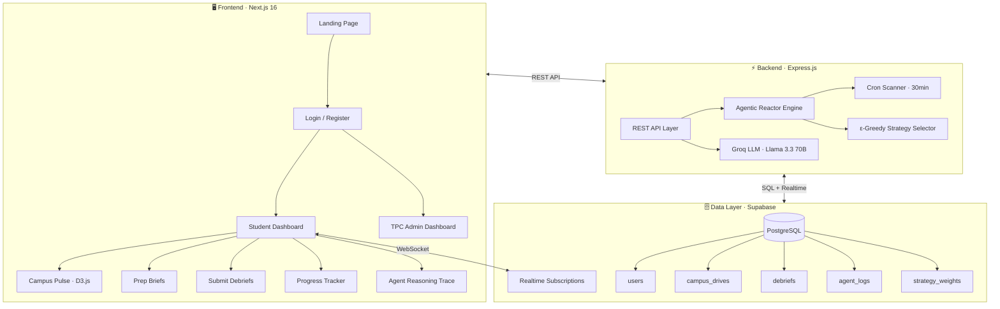

<div align="center">

# 🧠 CampusIntel

### The Autonomous Intelligence Platform for Campus Placements

**From Reactive Chatbots → Proactive AI Agents**

[](https://campusintel.vercel.app)
[](https://campusintel-backend-production.up.railway.app/health)
[](https://nextjs.org)
[](https://supabase.com)
[](https://groq.com)

<br/>

> *"Every interview that happened before yours — working for you."*

</div>

---

## 🎯 The Problem We Solved

| Traditional Approach | CampusIntel |
|---|---|
| Students prepare from **stale internet lists** | Agent synthesizes **live peer debriefs** from your campus |
| Students don't know what they don't know | Agent **detects critical skill gaps** before the student fails |
| TPCs learn about failures **after rejection** | Agent **alerts TPCs proactively** with specific gap analysis |
| Manual chatbot prompts ("help me with DSA") | **Zero-prompt autonomy** — agent runs without being asked |
| Generic advice for everyone | **Personalized briefs** calibrated to your resume + company patterns |

**The fundamental flaw in existing tools:** If a student doesn't know they have a critical gap in System Design, they won't even know to ask an AI for help. CampusIntel's agent finds the gap *for* them.

---

## 🏗️ System Architecture



---

## 🔥 Features

### 1. Zero-Friction Onboarding
> *No forms. No data entry. 30 seconds to a full profile.*

Students drag-and-drop their **resume PDF**. The AI extracts a normalized skill profile instantly. A **3-layer validation system** ensures only legitimate CVs are accepted:

| Layer | What it does |
|---|---|
| **Frontend** | Checks file extension + MIME type (PDF only) |
| **Backend — Category Scanner** | Validates content across 5 resume categories (Identity, Education, Professional, Skills, Contact) — must match ≥3 categories |
| **Backend — Anti-Pattern Detector** | Rejects invoices, assignments, textbooks, prescriptions, etc. |

---

### 2. The Agentic Reasoning Engine
> *9 autonomous decisions. Zero human prompts.*

The agent doesn't wait to be asked. A **cron job** scans upcoming drives every 30 minutes and triggers the full reasoning loop for unprocessed students:

```
Step 1  OBSERVE_PROFILE         → Load student skills + company requirements
Step 2  COLD_START_DETECTED     → Check if enough data exists to proceed
Step 3  QUERY_LOCAL_DB          → Pull debriefs from this campus (threshold: 5)
Step 4  QUERY_GLOBAL_DB         → Fallback: pull cross-campus intel if local is sparse
Step 5  ASSESS_READINESS        → Calculate gap severity per topic (CRITICAL / MODERATE / OK)
Step 6  SELECT_STRATEGY         → ε-Greedy RL picks the best intervention type
Step 7  GENERATE_BRIEF          → LLM produces a personalized 7-day prep plan
Step 8  GENERATE_ASSESSMENT     → LLM generates targeted practice questions
Step 9  ALERT_TPC               → Flag at-risk students to administrators
```

Every step is **logged to the database** and viewable in the live Agent Reasoning Trace.

---

### 3. ε-Greedy Reinforcement Learning
> *The agent learns which interventions actually work.*

The `strategy_weights` table stores historical success rates per intervention type:

| Strategy | Win Rate | When Used |
|---|---|---|
| `BRIEF_ONLY` | 0.52 | Confident student, just needs a brief |
| `BRIEF_ASSESS` | 0.67 | Low confidence — brief + assessment |
| `BRIEF_ASSESS_SESSION` | 0.71 | Critical gaps — full intervention |
| `PEER_CONNECT` | 0.45 | Connect with peers who cleared similar rounds |

The agent **explores with ε probability** (trying new strategies) and **exploits** the highest win-rate strategy otherwise. Outcomes are recorded back, closing the feedback loop.

---

### 4. Campus Pulse — Live Intelligence Network
> *A living, breathing visualization of campus intelligence flow.*

Built with **D3.js force-directed physics**, the Campus Pulse renders every student, company, and debrief as nodes in an interactive network:

- 🟣 **Central Hub** follows your cursor with magnetic physics
- 🔵 **Student nodes** pulse with their readiness scores
- 🟢 **Company nodes** sized by debrief count
- 🔴 **Debrief nodes** appear in real-time as students submit

---

### 5. TPC Admin Dashboard
> *Predictive pipeline management — not reactive firefighting.*

Secured to `tpc@lpu.in` only. Features:

| Tab | What it shows |
|---|---|
| **📊 Overview** | Live KPIs computed from real student data — total students, avg readiness, at-risk count |
| **👥 Student Roster** | Every registered student with skill scores, states, and gap analysis |
| **🏢 Company Intel** | Drive-specific analytics with confidence ratings |
| **⚠️ Live Alerts** | Agent-generated alerts with one-click "Send to Respective Department" |
| **🤖 Agent Engine** | Placement funnel, strategy weight visualization, outcome recording |

---

### 6. Real-Time Reactivity
> *Submit a debrief → Dashboard updates across all open tabs. No refresh needed.*

The event system (`lib/events.ts`) uses `BroadcastChannel` + `CustomEvent` to propagate changes:

```
Student submits debrief
    → Backend processes + stores in Supabase
    → Frontend emits 'ci:debrief-updated' event
    → Dashboard, Briefs, Drives, Pulse ALL refresh automatically
    → Other browser tabs sync via BroadcastChannel
```

---

## 🛠️ Tech Stack

| Layer | Technology | Why |
|---|---|---|
| **Frontend** | Next.js 16 (App Router) | Server components + client interactivity |
| **Styling** | Tailwind CSS | Rapid, consistent dark theme |
| **Visualization** | D3.js (custom force graph) | Native physics simulation for Campus Pulse |
| **Backend** | Node.js + Express | Lightweight, fast API layer |
| **AI / LLM** | Groq (Llama 3.3 70B + 3.1 8B) | Fast inference for brief generation + skill extraction |
| **Database** | Supabase (PostgreSQL) | Realtime subscriptions + row-level security |
| **PDF Processing** | pdf-parse | Resume text extraction |
| **Scheduling** | node-cron | 30-min drive scanner |
| **Deployment** | Vercel (frontend) + Railway (backend) | Zero-config CI/CD |

---

## 📡 API Reference

### Authentication
```
POST /api/student/login          { email }           → { success, student }
POST /api/student/register       { name, email, ... } → { success, student, token }
```

### Student
```
GET  /api/student/:id                                → student profile
GET  /api/student/:id/registrations                  → drive registrations
POST /api/student/upload-resume  { studentId, pdfBase64 } → { skills, scores }
```

### Agent
```
POST /api/agent/trigger-demo                         → { sessionId }
POST /api/agent/trigger          { studentId, driveId } → { sessionId }
GET  /api/agent/logs/:sessionId                      → [agent step logs]
GET  /api/agent/status                               → recent sessions
```

### Drives
```
GET  /api/drives/:collegeId                          → [upcoming drives]
GET  /api/drives/:driveId/detail                     → drive + company info
POST /api/drives/:driveId/register { studentId }     → registration confirmation
```

### Debriefs
```
POST /api/debriefs               { driveId, roundType, questionsAsked, ... }
GET  /api/debriefs/:collegeId/:companyId             → [synthesized intel]
```

### TPC Admin
```
GET  /api/tpc/students/:collegeId                    → [all students]
GET  /api/tpc/alerts/:collegeId                      → [live alerts]
GET  /api/tpc/strategy-weights/:collegeId/:companyId → strategy weights
POST /api/tpc/record-outcome     { studentId, driveId, outcome }
```

---

## ⚙️ Local Setup

### Prerequisites
- Node.js v18+
- Supabase project (free tier works)
- Groq API key ([console.groq.com](https://console.groq.com))

### 1. Database
```bash
# Open Supabase SQL Editor and run:
database/schema.sql    # Create tables
database/seed.sql      # Seed companies + drives
database/demo_seed.sql # Sample student data
```

### 2. Backend
```bash
cd campusintel-backend
npm install
cp .env.example .env   # Then fill in your keys
npm run dev             # → http://localhost:3001
```

```env
PORT=3001
SUPABASE_URL=https://your-project.supabase.co
SUPABASE_SERVICE_ROLE_KEY=your_key
GROQ_API_KEY=gsk_your_groq_key
```

### 3. Frontend
```bash
cd campusintel-frontend
npm install
cp .env.example .env.local   # Then fill in your keys
npm run dev                   # → http://localhost:3000
```

```env
NEXT_PUBLIC_API_URL=http://localhost:3001
NEXT_PUBLIC_SUPABASE_URL=https://your-project.supabase.co
NEXT_PUBLIC_SUPABASE_ANON_KEY=your_anon_key
```

---

## 🔐 Security

| Feature | Implementation |
|---|---|
| **TPC Route Protection** | Client-side email check (`tpc@lpu.in` only) + server redirect |
| **TPC Sidebar Visibility** | Hidden from all non-admin users |
| **Resume Validation** | 3-layer check: file type → content categories → anti-pattern scan |
| **Auth Persistence** | `localStorage` with token-based headers on all API calls |
| **CORS** | Configured to reflect trusted origins |

---

## 📂 Project Structure

```
campusintel/
├── campusintel-frontend/          # Next.js 16 App
│   ├── app/
│   │   ├── (student)/             # Student-facing pages
│   │   │   ├── dashboard/         # Main dashboard
│   │   │   ├── briefs/            # AI-generated prep briefs
│   │   │   ├── debrief/           # Submit interview debriefs
│   │   │   ├── drives/            # Campus drive listings
│   │   │   └── progress/          # Readiness progress tracker
│   │   ├── demo/                  # Agent reasoning trace (live)
│   │   ├── pulse/                 # Campus Pulse (D3.js)
│   │   ├── tpc/dashboard/         # TPC admin panel (secured)
│   │   ├── login/                 # Authentication
│   │   └── onboarding/            # New user registration + resume
│   ├── components/
│   │   ├── agent/                 # ReasoningTrace, ConfidenceChart
│   │   ├── student/               # ResumeUploader, PrepBrief
│   │   ├── tpc/                   # TpcDashboard, AgentEngine
│   │   ├── layout/                # Sidebar navigation
│   │   └── tour/                  # Interactive walkthrough
│   └── lib/
│       ├── api.ts                 # REST API client
│       ├── auth.ts                # localStorage auth manager
│       └── events.ts              # Cross-tab event system
│
├── campusintel-backend/           # Express.js API
│   └── src/
│       ├── routes/
│       │   ├── student.js         # Auth, registration, resume upload
│       │   ├── agent.js           # Trigger agent, fetch logs
│       │   ├── drives.js          # Campus drive CRUD
│       │   ├── debriefs.js        # Debrief submission + synthesis
│       │   └── tpc.js             # Admin endpoints
│       ├── agent/
│       │   └── reactor.js         # 9-step agentic reasoning loop
│       └── lib/
│           ├── grok.js            # Groq LLM client (Llama 3.3)
│           └── supabase.js        # Supabase client
│
└── database/
    ├── schema.sql                 # Table definitions
    ├── seed.sql                   # Company + drive data
    └── demo_seed.sql              # Sample student profiles
```

---

## 👥 Team

Built for **Hack2AI** by **Team CampusIntel** at Lovely Professional University.

---

<div align="center">

**⚡ Autonomous. Proactive. Intelligent.**

*CampusIntel doesn't wait for students to ask for help — it finds the gaps before they fail.*

</div>
